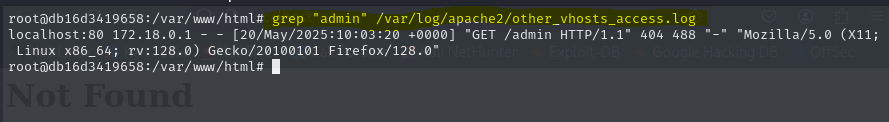

# PPS-Unidad3Actividad22-David
###  Detectar intentos de ataque en los logs

Como estamos trabajando con un escenario multicontenedor docker, hay algunas peculiaridades. Por ejemplo, parte de los logs se guardan en el archivo other_vhosts_access.log en vez de access.log. Si las consultas no dan resultados prueba con access.log.

##### Buscar accesos a la página de administración

Detectar intentos de acceso a rutas sensibles como /admin:




##### Contar cuántas veces una IP ha intentado acceder

Para ver si una IP está haciendo muchas peticiones sospechosas:


##### Ver actividad en tiempo real y filtrar por palabra clave

Monitorear en vivo cualquier intento de acceso a /wp-admin (Página de administración de WordPress por defecto):


### Configurar alertas automáticas con Fail2Ban

Configuramos el archivo de configuración de fail2ban:


Esto bloqueará una IP por 1 hora si realiza más de 5 intentos fallidos.

### Configuración de Fail2Ban en un entorno LAMP con Docker

docker-compose.yml -->


Cremos las carpetas necesarias si no existen:


Tendremos que crear un dockerfile con las variables necesarias para el docker-compose.


Y por último configuramos el fail2ban:


Una vez levantado el docker.comose comprobamos el log de fail2ban.


Realizamos un ejemplo baneando una IP.


### Usar herramientas de SIEM (Security Information and Event Management)

#####  Agregar el repositorio de Elastic


Tendremos que configurar el fichero de /etc/elasticsearch/elasticsearch.yml.

``` # ======================== Elasticsearch Configuration =========================
# ----------------------------------- Paths ------------------------------------
path.data: /var/lib/elasticsearch
path.logs: /var/log/elasticsearch
# ---------------------------------- Network -----------------------------------
network.host: 0.0.0.0
http.port: 9200
# ---------------------------------- Security ----------------------------------
xpack.security.enabled: false
xpack.security.http.ssl.enabled: false
xpack.security.transport.ssl.enabled: false 
```

Verificar si Elasticsearch está funcionando.


##### Configurar Logstash para Apache

Añadir la configuración para procesar logs de Apache


Verificar que Logstash está procesando los logs


##### Configurar Kibana
Acceder a Kibana desde el navegador: http://localhost:5601


##### Instalar y configurar Filebeat para Apache
Instalar Filebeat.


Editar la configuración de Filebeat


Verificar que Filebeat está enviando logs.


Verificar que los logs de Apache están en Kibana.


Si todo está configurado correctamente ir a la sección Analytics → Discover, buscar el índice filebeat-* y se debería ver los logs en tiempo real.


FIN